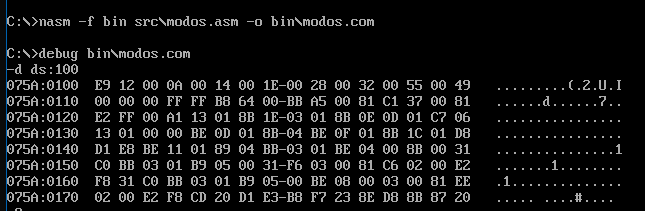
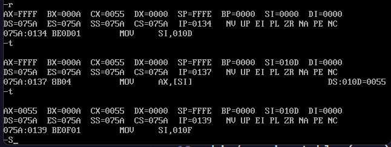

## Laboratorio Unidad 6 - Modos de Direccionamiento (NASM)

## Descripción

Se implementó un programa en ensamblador que demuestra los modos de direccionamiento inmediato, directo, indirecto por registro e indexado, verificando su funcionamiento en DEBUG.

## Estructura del proyecto

src/ → código fuente (.asm)
bin/ → ejecutable (.com)
capturas/ → evidencias

## 1: Verificación de memoria

Se utilizó el comando `d ds:100` en DEBUG para visualizar el array y las variables en memoria, identificando los valores en formato hexadecimal.

## 2: Modo indirecto

Se utilizó el comando `t` para trazar la ejecución paso a paso y `r` para verificar los registros, observando el uso de SI como puntero y obteniendo AX=0055h (85 decimal).

## 3: Modo indexado

Se ejecutó el programa completo con `g` y se verificó con `r` que la suma del array mediante direccionamiento indexado dio AX=0096h (150 decimal).

